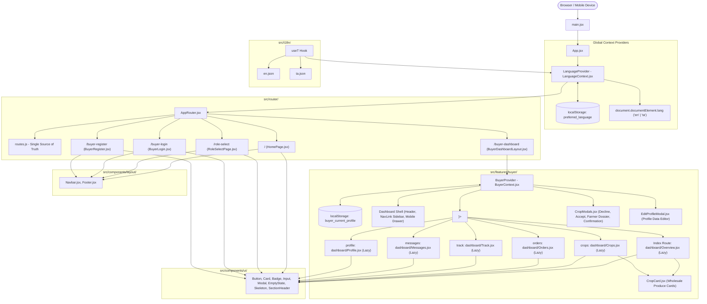

# Naam Uzhavar (நாம் உழவர்) — Complete Frontend Architecture Specification

> **Target Audience:** AI Engineering Assistants (Claude / GPT), Technical Leads, and System Architects.  
> **Repository:** `d:\mini project` (`mini_project-1`)  
> **Architecture Version:** 3.0.0 (Feature-Sliced Modular & Centralized i18n Architecture)  
> **Framework Stack:** React 18 (SPA) + Vite 8 + React Router DOM v6 + Bootstrap 5.3 (Sass) + Oxlint  
> **Quality Status:** Frontend prototype (mock data, client-side only)

---

## 1. System Overview & Core Philosophy

**Naam Uzhavar** ("We are Farmers") is an agri-tech direct trade operating system built specifically for Tamil Nadu's farming and commercial kitchen supply chain. The application disintermediates agricultural commerce by establishing direct contracts between three parties:

1. **🌾 Cultivators / Farmers (விவசாயிகள்):** Farm-gate harvest listings, mandi bench pricing, 0% middleman deduction, instant buyer confirmation.
2. **🏢 Commercial Buyers (வணிக வாங்குவோர்):** Hotels, caterers, supermarkets, and wholesale distributors procuring Grade-A produce with batch farm traceability.
3. **🚚 Logistics Driver Partners (சரக்கு ஓட்டுநர்கள்):** Short-haul electric mini-truck (EV) fleet operators providing GPS-tracked farm-to-kitchen cold/fresh transport.

### Architectural Principles
- **Bootstrap 5.3 Design System:** Use Bootstrap 5.3 (Sass-themed via `src/styles/custom.scss`) through the thin wrappers in `src/components/ui/`; do not add Tailwind, Material-UI or CSS-in-JS; no hardcoded colors, use tokens.
- **Strict Single Source of Truth for Routing:** No hardcoded URL string literals permitted across the component tree. All links and transitions reference the `ROUTES` dictionary.
- **Exhaustive Internationalization (i18n):** Zero hardcoded English/Tamil string literals or inline per-component translation dictionaries. All UI copy is externalized to `en.json` and `ta.json`, strictly validated by CI parity checks.
- **Native Tamil Script Anti-Clipping:** Tamil glyphs feature tall ascenders (கொ, றி) and low descenders (று, து). All text containers, buttons, and badges strictly enforce `line-height: 1.35` minimum to prevent visual clipping.
- **Pragmatic Layered State:** Local UI state (`useState`), domain workflow state (`useBuyer` context), and global preferences (`useLanguage` context) with clean `localStorage` synchronization.

---

## 2. Complete High-Level Architecture Diagram



---

## 3. Directory Layout & Manifest

```
d:\mini project\
├── public/                                    # Public Static Assets
│   ├── buyer-produce-hero.jpg                # High-res produce imagery
│   ├── favicon.svg                           # Agricultural sprout SVG favicon
│   └── logo.jpg                              # Official Naam Uzhavar circular brand mark
├── scripts/
│   └── check-i18n.js                         # Automated key parity validator for CI/pre-commit
├── src/
│   ├── assets/
│   │   └── images/
│   │       └── logo.jpg                      # Bundled logo asset
│   ├── components/
│   │   ├── layout/                           # Global Shell Components
│   │   │   ├── Navbar.jsx                    # Shared public navbar (react-bootstrap Navbar, mobile collapse)
│   │   │   ├── Footer.jsx                    # Shared responsive footer & district hubs (Bootstrap grid)
│   │   │   └── index.js                      # Barrel export for layout
│   │   └── ui/                               # Reusable Atomic UI Primitives (Thin wrappers around react-bootstrap)
│   │       ├── Badge.jsx                     # Status & quality grade pills (react-bootstrap Badge)
│   │       ├── Button.jsx                    # Semantic buttons (5 variants, 3 sizes, loading with Spinner)
│   │       ├── Card.jsx                      # Modular card shells (elevated, outlined, interactive)
│   │       ├── EmptyState.jsx                # Empty search / zero-order illustration & CTA (Bootstrap utilities)
│   │       ├── Input.jsx                     # Text, select, textarea wrapper (Form.Control & InputGroup)
│   │       ├── Modal.jsx                     # Accessible modal dialog with focus trap (react-bootstrap Modal)
│   │       ├── SectionHeader.jsx             # Title, eyebrow badge, and action slot header (Bootstrap utilities)
│   │       ├── Skeleton.jsx                  # Animated shimmer placeholders (placeholder-glow)
│   │       └── index.js                      # Barrel export for all UI primitives
│   ├── context/
│   │   └── LanguageContext.jsx               # Global { lang, setLang, toggleLang } provider
│   ├── features/
│   │   └── buyer/                            # Commercial Buyer B2B Feature Domain
│   │       ├── components/
│   │       │   ├── CropCard.jsx              # Produce auction lot card with pricing & quick actions
│   │       │   ├── CropModals.jsx            # 4-stage ordering modals (Decline, Accept, Dossier, Order)
│   │       │   └── EditProfileModal.jsx      # Business profile & delivery gate configuration modal
│   │       ├── context/
│   │       │   └── BuyerContext.jsx          # Unified buyer domain state provider & custom hook
│   │       ├── data/
│   │       │   └── mockData.js               # Initial seed state (INITIAL_CROPS, ORDERS, MESSAGES)
│   │       ├── layout/                       # Buyer Workstation Layout Shell
│   │       │   ├── BuyerDashboardLayout.jsx  # Layout shell (topbar, NavLink sidebar, Offcanvas drawer, <Outlet />)
│   │       │   └── BuyerDashboardLayout.css  # Layout grid & navigation styling
│   │       └── pages/                        # Buyer Route Page Views
│   │           ├── auth/                     # Commercial Buyer Authentication
│   │           │   ├── BuyerLogin.jsx + .css # Identifier/PIN login & demo credentials
│   │           │   └── BuyerRegister.jsx + .css # 4-step B2B onboarding wizard
│   │           └── dashboard/                # Nested Dashboard Subpages (Directly Lazy-Loaded)
│   │               ├── Overview.jsx + .css   # Metric statistics, rapid re-orders, transit banner
│   │               ├── Crops.jsx + .css      # Mandi catalog, search, category chips, sort drop-down
│   │               ├── Orders.jsx + .css     # Purchase orders ledger with status tabs & invoices
│   │               ├── Track.jsx + .css      # Real-time GPS transit simulator, telemetry, driver dossier
│   │               ├── Messages.jsx + .css   # Instant 2-way chat dispatch console with farmers & drivers
│   │               └── Profile.jsx + .css    # 9-point trade specification, GSTIN validation, photo editor
│   ├── i18n/
│   │   ├── en.json                           # Canonical English dictionary
│   │   ├── ta.json                           # Canonical Tamil dictionary
│   │   ├── useT.js                           # Custom translation hook with interpolation
│   │   └── index.js                          # Barrel export for i18n utilities
│   ├── pages/                                # Top-Level Application Pages (Directly imported, no barrel)
│   │   ├── HomePage.jsx                      # Public bilingual landing page
│   │   ├── RoleSelectPage.jsx                # 3-way persona selector (Farmer, Buyer, Driver)
│   │   └── RoleSelectPage.css                # Persona grid styles
│   ├── router/
│   │   ├── routes.js                         # Centralized immutable route strings (ROUTES.*)
│   │   ├── ProtectedRoute.jsx                # Route protection (auth/guest guards)
│   │   ├── AppRouter.jsx                     # Top-level route switch, direct lazy routes, wildcard fallback
│   │   └── index.js                          # Barrel export for router
│   ├── styles/
│   │   ├── custom.scss                       # Bootstrap 5.3 Sass variable overrides & modular imports
│   │   └── global.css                        # Global CSS tokens, resets, typography, responsive rules
│   ├── App.jsx                               # Application root managing session lifecycle
│   └── main.jsx                              # Vite React entry point
├── FRONTEND_ARCHITECTURE.md                  # This architectural reference specification
├── package.json                              # Scripts, dependencies, and project metadata
└── vite.config.js                            # Vite bundler configuration with Sass modern compiler
```

---

## 4. Routing Engine Specification

### Route Constants (`src/router/routes.js`)
All route paths are defined as immutable properties of `ROUTES`:
```javascript
export const ROUTES = {
  HOME: '/',
  ROLE_SELECT: '/role-select',
  BUYER_LOGIN: '/buyer-login',
  BUYER_REGISTER: '/buyer-register',
  BUYER_DASHBOARD: '/buyer-dashboard',
  BUYER_DASHBOARD_CROPS: '/buyer-dashboard/crops',
  BUYER_DASHBOARD_ORDERS: '/buyer-dashboard/orders',
  BUYER_DASHBOARD_TRACK: '/buyer-dashboard/track',
  BUYER_DASHBOARD_MESSAGES: '/buyer-dashboard/messages',
  BUYER_DASHBOARD_PROFILE: '/buyer-dashboard/profile',
};
```

### Route Hierarchy & Lazy Loading (`src/router/AppRouter.jsx`)
```jsx
<Routes>
  {/* 1. Public Views */}
  <Route path={ROUTES.HOME} element={<HomePage />} />
  <Route path={ROUTES.ROLE_SELECT} element={<RoleSelectPage />} />

  {/* 2. Guest-Only Auth Routes (Logged-in users redirected to dashboard) */}
  <Route
    path={ROUTES.BUYER_LOGIN}
    element={
      <ProtectedRoute mode="guest">
        <BuyerLogin />
      </ProtectedRoute>
    }
  />
  <Route
    path={ROUTES.BUYER_REGISTER}
    element={
      <ProtectedRoute mode="guest">
        <BuyerRegister />
      </ProtectedRoute>
    }
  />

  {/* 3. Protected Dashboard Routes (Unauthenticated redirected to login) */}
  <Route
    path={ROUTES.BUYER_DASHBOARD}
    element={
      <ProtectedRoute mode="auth">
        <BuyerDashboardLayout />
      </ProtectedRoute>
    }
  >
    <Route index element={<Suspense fallback={<DashboardPageFallback />}><Overview /></Suspense>} />
    <Route path="crops" element={<Suspense fallback={<DashboardPageFallback />}><Crops /></Suspense>} />
    <Route path="orders" element={<Suspense fallback={<DashboardPageFallback />}><Orders /></Suspense>} />
    <Route path="track" element={<Suspense fallback={<DashboardPageFallback />}><Track /></Suspense>} />
    <Route path="messages" element={<Suspense fallback={<DashboardPageFallback />}><Messages /></Suspense>} />
    <Route path="profile" element={<Suspense fallback={<DashboardPageFallback />}><Profile /></Suspense>} />
  </Route>

  {/* 4. Wildcard Fallback */}
  <Route path="*" element={<Navigate to={ROUTES.HOME} replace />} />
</Routes>
```

### Route Guarding: `ProtectedRoute.jsx`
Located in `src/router/ProtectedRoute.jsx`:
- **`mode='auth'` (default)**: Protects private routes (e.g. `/buyer-dashboard`). If no profile is detected in `localStorage ('buyer_current_profile')`, the user is redirected to `ROUTES.BUYER_LOGIN`.
- **`mode='guest'`**: Guards onboarding and auth gates (e.g. `/buyer-login`, `/buyer-register`). If a valid profile exists, authenticated buyers are redirected to `ROUTES.BUYER_DASHBOARD`.


### NavLink Sidebar Active Matching
In `BuyerDashboardLayout.jsx`, navigation links use `<NavLink to="...">`:
```jsx
<NavLink
  to={item.to}
  end={item.to === ROUTES.BUYER_DASHBOARD}
  className={({ isActive }) =>
    `buyer-sidebar-item ${isActive ? 'buyer-sidebar-item--active' : ''}`
  }
>
  <item.icon size={19} />
  <span>{item.label}</span>
</NavLink>
```
Setting `end={true}` on the root dashboard route ensures `/buyer-dashboard` is not highlighted when a child route like `/buyer-dashboard/crops` is active.

---

## 5. Centralized Internationalization (i18n) Engine

### Overview
The translation engine supports full dynamic bilingual switching (`en` ⇋ `ta`) with zero application reloads. The state is driven by `LanguageContext` and consumed via the `useT` hook.

### Key Namespaces (442 synchronized keys)
| Namespace | Scope & Usage |
| :--- | :--- |
| `common` | Global buttons (`cancel`, `confirm`, `back`), badge states (`gradeA`, `inTransit`), navbar titles, footer links, role titles. |
| `home` | Landing page hero headings, live ticker commodities, 4 pillars of direct trade, 3-step workflow, testimonials, call to action. |
| `roleSelect` | 3 role selection cards, benefits bullet points, farmer and driver modal intake forms. |
| `buyerLogin` | Login credentials input labels, quick demo account shortcuts, forgot password flow. |
| `buyerRegister` | 4-step onboarding wizard labels, trade categories, address and bay inputs, verification badges. |
| `buyerDashboard` | Overview stats, crop cards, search & filter pills, order tracking steps, driver card, chat messages, profile view, produce modals. |

### The `useT(namespace)` Hook Architecture (`src/i18n/useT.js`)
```javascript
import { useLanguage } from '../context/LanguageContext';
import en from './en.json';
import ta from './ta.json';

const translations = { en, ta };

export function useT(namespace = '') {
  const { lang, setLang, toggleLang } = useLanguage();
  const currentDict = translations[lang] || translations.en;

  const t = (key, params) => {
    // 1. Resolve namespaced or nested dot path
    let value = resolvePath(currentDict, namespace ? `${namespace}.${key}` : key);
    
    // 2. Fallback to root or default dictionary if key is missing
    if (value === undefined && namespace) {
      value = resolvePath(currentDict, key);
    }
    if (value === undefined) {
      value = resolvePath(translations.en, namespace ? `${namespace}.${key}` : key);
    }
    if (value === undefined) return key;

    // 3. Interpolate parameters: {name}, {n}, {id}, {speed}
    if (params && typeof params === 'object') {
      return Object.keys(params).reduce((str, paramKey) => {
        return str.replace(new RegExp(`{${paramKey}}`, 'g'), params[paramKey]);
      }, value);
    }

    return value;
  };

  return { t, lang, setLang, toggleLang };
}
```

### CI Key Parity Check (`scripts/check-i18n.js`)
Runs as `npm run i18n:check`. Recursively parses `en.json` and `ta.json`, comparing leaf key paths. Exits with code 1 if any key is missing in either file.

### Tamil Typography & Anti-Clipping Standards
1. **Font Declarations (`src/index.css`):**
   ```css
   --font-family: 'Plus Jakarta Sans', 'Noto Sans Tamil', 'Mukta Malar', system-ui, sans-serif;
   --font-family-ta: 'Noto Sans Tamil', 'Mukta Malar', 'Plus Jakarta Sans', system-ui, sans-serif;
   ```
2. **HTML Synchronized Styling:**
   ```css
   html[lang="ta"] {
     font-family: var(--font-family-ta);
   }
   html[lang="ta"] body {
     line-height: 1.65;
   }
   ```
3. **Anti-Clipping Rule:**
   Tamil vowels and conjuncts (e.g. றி, று, கொ, னை) possess distinct vertical extensions. Any UI element displaying Tamil text (specifically `Button.css`, `Badge.css`, and navigation links) must have `line-height: 1.35;` minimum and avoid rigid `height` constraints without sufficient vertical padding.

---

## 6. Atomic UI Design System (`src/components/ui/`)

The application enforces consistent visual language across all screens through 8 atomic primitives:

```
src/components/ui/
├── Button.jsx (.css)       # Primary, secondary, ghost, outline, danger; loading spinner; line-height: 1.35
├── Card.jsx (.css)         # Default, elevated, outlined, tinted, interactive; variable padding
├── Badge.jsx (.css)        # Status & grade indicators (success, warning, danger, grade, gold, info)
├── Input.jsx (.css)        # Accessible inputs, select dropdowns, textareas with icons & error text
├── Modal.jsx (.css)        # Accessible dialog with ESC dismissal, backdrop blur & compound components
├── EmptyState.jsx (.css)   # Illustrated placeholder with heading, body, and CTA button
├── Skeleton.jsx (.css)     # Shimmer loaders for async transitions (text, avatar, card, rect)
└── SectionHeader.jsx (.css)# Consistent section heading with eyebrow badge & action slot
```

### Component Signatures

#### `Button`
```jsx
<Button
  variant="primary" | "secondary" | "ghost" | "outline" | "danger"
  size="sm" | "md" | "lg"
  isLoading={boolean}
  fullWidth={boolean}
  icon={<LucideIcon size={18} />}
  onClick={handler}
>
  Button Label
</Button>
```

#### `Card`
```jsx
<Card
  variant="default" | "elevated" | "outlined" | "tinted"
  padding="none" | "sm" | "md" | "lg"
  interactive={boolean}
  onClick={handler}
>
  Card Content
</Card>
```

#### `Badge`
```jsx
<Badge
  variant="default" | "success" | "warning" | "danger" | "info" | "gold" | "grade"
  size="sm" | "md" | "lg"
  icon={<CheckCircle size={13} />}
>
  Badge Label
</Badge>
```

#### `Input`
```jsx
<Input
  label="Business Trade Name"
  error="Trade name is required"
  helperText="As registered in your GSTIN certificate"
  startIcon={<Building size={16} />}
  endIcon={<Check size={16} />}
  fullWidth={true}
  value={val}
  onChange={e => setVal(e.target.value)}
/>
```

#### `Modal` (Compound Pattern)
```jsx
<Modal isOpen={isOpen} onClose={handleClose} maxWidth="560px">
  <Modal.Header title="Confirm Procurement Order" onClose={handleClose} />
  <Modal.Body>
    Modal content and confirmation details...
  </Modal.Body>
  <Modal.Footer>
    <Button variant="ghost" onClick={handleClose}>Cancel</Button>
    <Button variant="primary" onClick={handleConfirm}>Confirm</Button>
  </Modal.Footer>
</Modal>
```

#### `EmptyState`
```jsx
<EmptyState
  icon={<Search size={48} />}
  title="No matching crops found"
  description="Try adjusting your category filter or search query"
  action={<Button variant="outline" onClick={handleReset}>Clear Filters</Button>}
/>
```

#### `Skeleton`
```jsx
<Skeleton variant="card" height={320} />
<Skeleton variant="text" width="60%" />
<Skeleton variant="avatar" width={48} height={48} />
```

#### `SectionHeader`
```jsx
<SectionHeader
  badge="Direct Harvest"
  title="Today's Farm Gate Arrivals"
  subtitle="Quality graded produce ready for immediate commercial dispatch"
  action={<Button size="sm" variant="ghost">View All</Button>}
  align="left" | "center"
/>
```

---

## 7. Commercial Buyer Feature Domain (`src/features/buyer/`)

The B2B Commercial Buyer experience is organized into a modular domain package:

```
src/features/buyer/
├── components/
│   ├── CropCard.jsx              # Reusable produce lot card
│   ├── CropModals.jsx            # 4 compound procurement modals
│   └── EditProfileModal.jsx      # Business credential editor modal
├── context/
│   └── BuyerContext.jsx          # Domain provider & useBuyer hook
├── data/
│   └── mockData.js               # Initial seed data
└── pages/
    ├── Overview.jsx              # Home summary metrics & transit highlight
    ├── Crops.jsx                 # Live wholesale harvest catalog
    ├── Orders.jsx                # Purchase orders tracking & invoices
    ├── Track.jsx                 # Live EV fleet telemetry & GPS stage simulator
    ├── Messages.jsx              # Direct communication console
    └── Profile.jsx               # Business credentials, GSTIN, & settings
```

### `BuyerContext` State & Methods
Exported via `useBuyer()`:

| State / Function | Type | Description |
| :--- | :--- | :--- |
| `profile` | `BuyerProfile` | Authenticated business profile with `localStorage` persistence. |
| `setProfile` | `Function` | Profile state updater. |
| `crops` | `CropItem[]` | Active list of wholesale produce available across regional hubs. |
| `filteredCrops` | `CropItem[]` | Dynamically filtered produce based on search query, category, and sort criteria. |
| `orders` | `OrderItem[]` | Purchase consignments ledger. Newly accepted orders are prepended here. |
| `selectedTrackingOrderId` | `string` | The active consignment ID bound to the live GPS tracker in `/buyer-dashboard/track`. |
| `trackingOrder` | `OrderItem` | The resolved order object currently being inspected in tracking view. |
| `messages` | `MessageItem[]` | Communication thread with dispatch coordinators and farmers. |
| `handleSendMessage(text)` | `Function` | Appends buyer reply and simulates auto-response. |
| `showToast(type, text)` | `Function` | Dispatches temporary toast alert (`success`, `info`, `warning`). |
| `handleOpenDecline(crop)` | `Function` | Opens decline confirmation modal for a crop lot. |
| `handleConfirmDecline(id)` | `Function` | Removes crop from buyer view and shows toast. |
| `handleOpenAccept(crop)` | `Function` | Opens produce quantity configurator modal. |
| `handleProceedToFarmer()` | `Function` | Advances to Farmer Dossier modal. |
| `handleConfirmOrder()` | `Function` | Creates new purchase order, links tracking ID, and opens confirmation modal. |
| `handleGoToTracking()` | `Function` | Closes confirmation modal and navigates directly to `/buyer-dashboard/track`. |
| `t` | `Function` | Pre-scoped translation function (`useT('buyerDashboard').t`). |
| `lang` | `'en' \| 'ta'` | Active language code. |
| `toggleLang` | `Function` | Swaps language between English and Tamil. |

---

## 8. Data Schema & Contracts

### `BuyerProfile`
```typescript
interface BuyerProfile {
  name: string;             // Establishment name (e.g. "Grand Palace Luxury Dining")
  shopName: string;         // Commercial trade moniker
  businessName: string;     // Registered business title
  contactPerson: string;    // Procurement head name
  phone: string;            // +91 format mobile number
  email: string;            // Official procurement email
  buyerType: 'hotel' | 'supermarket' | 'retailer' | 'mahal';
  businessType: string;     // e.g. "HOTEL Commercial Kitchen"
  address: string;          // Delivery unloading bay address
  gstin: string;            // 15-character Indian Goods & Services Tax ID
  photo?: string;           // Base64 or remote URL of establishment photo
  photoPreview?: string;    // Active data URI for instant avatar rendering
}
```

### `CropItem`
```typescript
interface CropItem {
  id: string;               // e.g. "crop-tomato-01"
  name: string;             // English crop name (e.g. "Country Tomato")
  tamilName: string;        // Native Tamil script name (e.g. "நாட்டு தக்காளி")
  category: 'vegetables' | 'grains' | 'fruits' | 'spices';
  grade: 'Grade A' | 'Grade B';
  gradeDesc: string;        // e.g. "Firm, uniform size, hub certified"
  pricePerKg: number;       // Wholesale farm-gate rate (₹)
  availableKg: number;      // Total lot weight (kg)
  minOrderKg: number;       // Minimum lot purchase (kg)
  hubName: string;          // Regional collection center
  hubCode: string;          // e.g. "DGL-HUB-01"
  distanceKm: number;       // Distance from buyer's hub
  harvestTime: string;      // Freshness timestamp
  image: string;            // High-resolution photography
  popular: boolean;         // Spotlight lot indicator
  farmer: {
    name: string;           // Farmer's full name
    farmerId: string;       // e.g. "FMR-TN-4821"
    village: string;        // Cultivation hub & district
    phone: string;          // Contact number
    rating: number;         // Historical harvest rating (e.g. 4.9)
    totalHarvests: number;  // Verified completed batches
  };
}
```

### `OrderItem`
```typescript
interface OrderItem {
  orderId: string;          // e.g. "NU-2026-00124"
  cropName: string;         // English produce name
  tamilCropName: string;    // Tamil produce name
  grade: string;            // "Grade A"
  quantityKg: number;       // Procured batch weight
  unitPrice: number;        // Agreed rate per kg
  totalPrice: number;       // Total billable amount (₹)
  orderTime: string;        // Timestamp
  status: 'active' | 'preparing' | 'in_transit' | 'delivered' | 'cancelled';
  hub: string;              // Origin hub
  farmer: {
    name: string;
    phone: string;
    location: string;
  };
  driver: {
    name: string;           // Driver partner name
    phone: string;          // Driver phone
    vehicleType: string;    // e.g. "Tata Ace EV Cargo"
    vehicleNumber: string;  // e.g. "TN 57 AB 1234"
    rating: number;         // e.g. 4.9
    capacityKg: number;     // e.g. 500
    deliveryPin: string;    // 4-digit verification code for gate receiver
  };
  liveTracking: {
    currentStatus: string;  // Stage description
    currentLocation: string;// Landmark or highway milestone
    estimatedMinutes: number;// ETA countdown
    distanceKm: number;     // Remaining distance
    lastUpdated: string;    // Heartbeat timestamp
    speedKmh: number;       // Real-time speed
    batteryPct: number;     // EV vehicle charge level
    origin: string;         // Farm gate / hub
    destination: string;    // Commercial buyer gate
  };
}
```

---

## 9. Global Design Tokens & Typography

All styling variables are defined at the `:root` level of `src/styles/global.css`:

```css
:root {
  /* Primary Agricultural Palette */
  --primary-950: #052e16;
  --primary-900: #14532d;         /* Deep Forest Green (Brand Theme) */
  --primary-800: #166534;
  --primary-700: #15803d;
  --primary-600: #16a34a;
  --primary-500: #22c55e;         /* Bright Leaf Green (Accents & Highlights) */
  --primary-100: #dcfce7;
  --primary-50:  #f0fdf4;         /* Subtle Green Tint for Cards */

  /* Harvest Amber & Orange */
  --harvest-900: #7c2d12;
  --harvest-700: #c2410c;
  --harvest-600: #ea580c;
  --harvest-500: #f97316;         /* Warning & Dispatch Status */
  --harvest-100: #ffedd5;
  --harvest-50:  #fff7ed;

  --amber-700:   #b45309;
  --amber-600:   #d97706;
  --amber-500:   #f59e0b;         /* Mandi Ticker Gold */
  --amber-100:   #fef3c7;
  --amber-50:    #fffbeb;

  /* Neutrals & Slate */
  --neutral-900: #0f172a;         /* High-contrast Headings */
  --neutral-800: #1e293b;         /* Standard Body Copy */
  --neutral-700: #334155;
  --neutral-600: #475569;         /* Subtitles & Meta Info */
  --neutral-400: #94a3b8;         /* Placeholders & Inactive Icons */
  --neutral-200: #e2e8f0;         /* Card Borders & Dividers */
  --neutral-100: #f1f5f9;         /* Light Background Tint */
  --neutral-50:  #f8fafc;         /* App Canvas Background */
  --white:       #ffffff;

  /* Standard Border Radii */
  --radius-sm:   8px;
  --radius-md:   12px;
  --radius-lg:   18px;
  --radius-xl:   26px;
  --radius-full: 9999px;

  /* Typography Stacks */
  --font-family: 'Plus Jakarta Sans', 'Noto Sans Tamil', 'Mukta Malar', system-ui, -apple-system, sans-serif;
  --font-family-ta: 'Noto Sans Tamil', 'Mukta Malar', 'Plus Jakarta Sans', system-ui, -apple-system, sans-serif;
}
```

---

## 10. Developer Workflows & Quality Verification

### Available Commands
```bash
# 1. Start Local Development Server
npm run dev

# 2. Run i18n Key Parity Check
npm run i18n:check

# 3. Run Static Linter (Oxlint)
npm run lint

# 4. Compile Production Bundle
npm run build

# 5. Preview Production Bundle Locally
npm run preview
```

### Pre-Flight Verification Criteria
Before declaring any task or code change complete, execute this sequential verification command:
```powershell
npm run i18n:check; npm run lint; npm run build
```
- **`npm run i18n:check`**: Must report that all i18n keys match perfectly between en.json and ta.json with zero missing keys.
- **`npm run lint`**: Must report `Found 0 warnings and 0 errors.` on all files.
- **`npm run build`**: Must transform all modules and emit `dist/` with 0 bundle errors.

---

## 11. Strict Rules of Engagement for Claude AI & Engineering Assistants

When asked to add features, refactor components, or debug code in this project, **strictly observe the following 8 architectural commandments**:

1. **NEVER Hardcode Route Strings:**  
   Always import `{ ROUTES }` from `src/router/routes.js`. Never write `<Link to="/buyer-dashboard/crops">` or `navigate('/buyer-login')`. Always use `ROUTES.BUYER_DASHBOARD_CROPS` and `ROUTES.BUYER_LOGIN`.

2. **NEVER Introduce Inline Translations or Ternary Language Dictionaries:**  
   Do not write `const dict = { en: '...', ta: '...' }` or `lang === 'en' ? 'Price' : 'விலை'`. Every user-visible text string MUST be extracted to `src/i18n/en.json` AND `src/i18n/ta.json`, then referenced via `const { t } = useT('namespace');`.

3. **Always Run Key Parity Check After Any i18n Edits:**  
   Any modification to `en.json` must be paired with an identical key addition to `ta.json`. Always run `npm run i18n:check` to prevent runtime translation fallback breakage.

4. **Always Prefer Atomic UI Primitives over Ad-Hoc Markup:**  
   Do not write raw HTML elements when a design system component exists:
   - Use `<Button>` instead of `<button className="...">`.
   - Use `<Card>` instead of `<div className="card">`.
   - Use `<Badge>` instead of `<span className="badge">`.
   - Use `<Input>` instead of `<input>` + `<label>` wrappers.
   - Use `<Modal>` instead of custom absolute overlay popups.
   - Use `<EmptyState>` when query or filter sets return 0 items.
   - Use `<Skeleton>` as the fallback during asynchronous loading.

5. **Bootstrap 5.3 Design System:**  
   Use Bootstrap 5.3 (Sass-themed via `src/styles/custom.scss`) through the thin wrappers in `src/components/ui/`; do not add Tailwind, Material-UI or CSS-in-JS; no hardcoded colors, use tokens.

6. **Strictly Protect Tamil Anti-Clipping Standards:**  
   When styling text, badges, or buttons, maintain `line-height: 1.35;` minimum. Never apply rigid pixel `height` constraints that cut off Tamil diacritical markers and vowel signs (கொ, றி, று).

7. **Respect Nested Sub-Routing Architecture:**  
   All new tabs or views inside the Commercial Buyer experience must be mounted as children of `ROUTES.BUYER_DASHBOARD` in `AppRouter.jsx` and loaded lazily via `React.lazy` with `<Suspense>`.

8. **Zero Warnings & Zero Errors Tolerance:**  
   Every code submission must produce 0 errors and 0 warnings under `oxlint` and compile cleanly under `vite build`.
